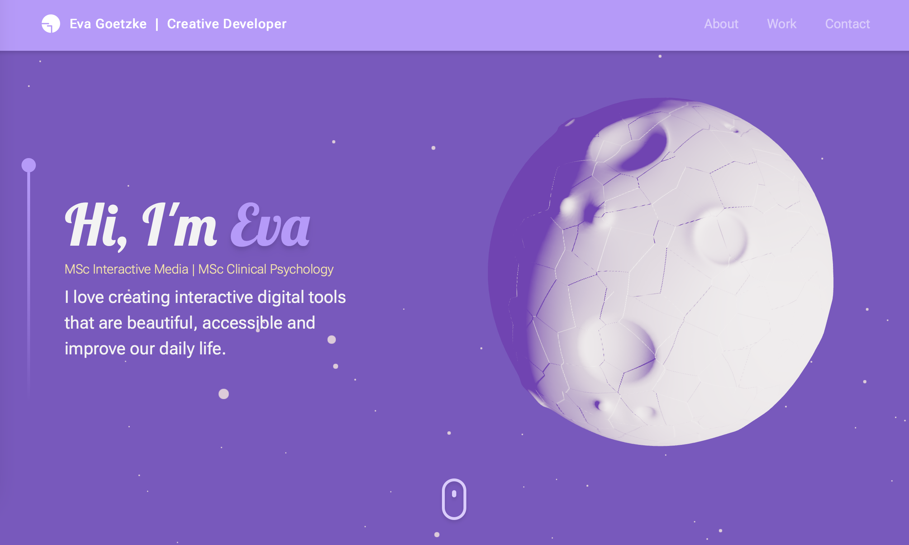

# esgoet.github.io - Portfolio Webpage

This repository hosts the code for my personal portfolio webpage, showcasing my skills, projects, and interactive 3D elements. You can access the live version of this portfolio at [esgoet.github.io](https://esgoet.github.io).

## Table of Contents

- [Introduction](#introduction)
- [Features](#features)
- [Technologies Used](#technologies-used)

## Introduction

This portfolio webpage serves as a hub for presenting my professional background, projects, and skills. It is designed to  provide an interactive and engaging experience.

## Features

- **3D Elements**: Interactive 3D elements are incorporated to create an engaging user experience.
- **Profile**: A personal profile section highlighting my skills, achievements, and background.
- **Project Showcase**: A section showcasing my best projects with descriptions and links.
- **Responsive Design**: The webpage is designed to work well on various screen sizes, from desktop to mobile.

## Technologies Used
For the back-end, I chose **Node.js** together with the **Next.js** framework to create the React app. 
To develop the app quickly, particular with focus on the speed of local development, I used **vitejs** with their react plug-in.
To further speed up development and make the website responsive, I employed the **tailwindcss** framework to style each components directly.

Previously familiar with three.js and JavaScript, the challenge for this portfolio was to learn how to use React and how to combine it with 3D elements through three.js.
For that purpose, I used the three-fiber ecosystem with its various helpers and abstractions:
- **@react-three/fiber**
- **@react-three/drei**
- **@react-three/gltfjsx**
- **@react-spring/three**
- **framer-motion-3d**
- **maath**

For other interactive features on the website, I employed
- **framer-motion**
- **react-tilt**
- **@emailjs/browser**

I used Github Pages to host the website, with a **gh-pages** set-up for deployment.

